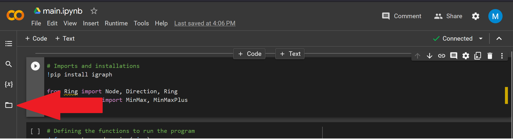
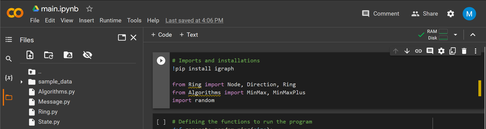
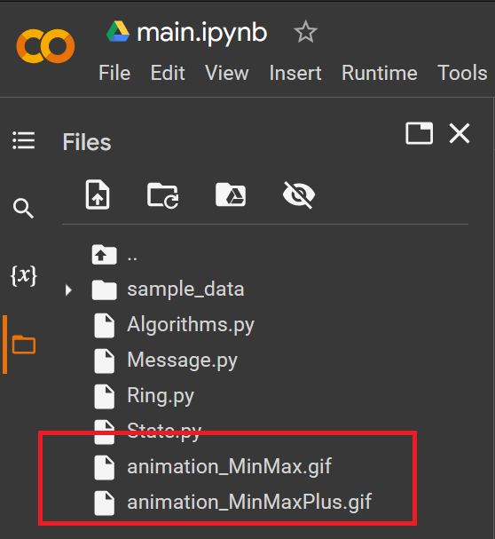
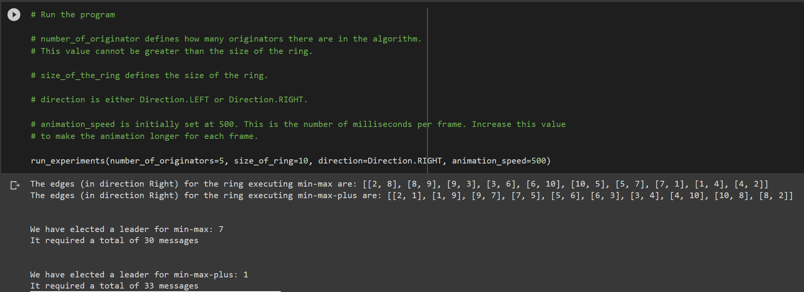
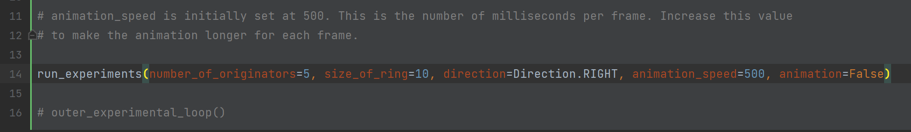
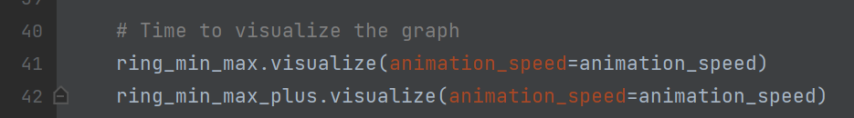

# CSI-5308
Project for course CSI-5308. This project is an implementation of the min-max and min-max+ algorithms.

# Instructions on how to run the program
### Setting up the environment
In order to run the program you first need to open google Colab in a browser: https://colab.research.google.com/.

Next you will prompted to upload a file. Select the `main.ipynb` file, this will open the main program.

Finally you will need to upload the files: `Algorithms.py`, `Messages.py`, `Ring.py` and `State.py` to the Colab environment.
You can do this by simply clicking on the file shaped icon in the sidebar and dragging the four files into the directory.
The resulting file structure should look the same as the second picture.

### Running the program
In order to run the program, ensure you run the cells in order. Clicking on each cell individually, or simply
selecting "Run all" from the Runtime drop-down menu in the top left.

The program will run and produce two gifs in the directory to which you have added the four files. These gifs will
be named "animation_MinMax.gif" and "animation_MinMaxPlus.gif". They make take some time to show up in the
directory.

You will also be able to see the outputs for the number of messages produced in each round.

### Modifying hyperparamters
The program is designed in such a way that you can modify four major hyperparameters. You can set these values to 
anything you like. However, the animation will take a long time to render if the values are very high.

To modify the following hyperparameters. Simply change the value in the call to the function `run_experiments`.

**number_of_originators:** Defines how many originators there are in the algorithm. This value cannot be greater than 
the size of the ring.

**size_of_ring:** Defines the size of the ring.

**direction:** Is either Direction.LEFT or Direction.RIGHT, and defines the direction in which messages are passed.

**animation_speed:** Is initially set at 500. This is the number of milliseconds per frame. Increase this value
to make the animation longer for each frame.

### Comparing Performance
If you would like to only compare the performance of the two algorithms, you can comment out the lines that create the
animation in order to scale the program to even greater sizes. As the animation becomes very computationally intensive
as the size of the ring grows.

Simply add the `animation=False` parameter to the function call `run_experiments`

Or comment out the following lines in `main.ipynb` and re-run all the code cells from the beginning.
